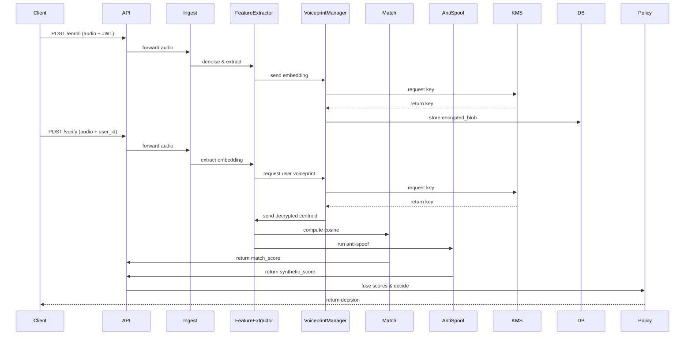

# Voice Identity Shield — Architecture & Step-by-Step Technical Plan

> A practical, deployable architecture diagram and step-by-step flow from voice enrollment to real-time verification, including encryption, matching, ML detection, APIs, database schema, and deployment recommendations.

---

## 1. Goals

* Create a secure voice signature (voiceprint) per user.
* Verify incoming audio in real time and detect synthetic/deepfake voices.
* Ensure privacy (encrypted storage) and tamper-evidence.
* Provide an easy-to-integrate API/SDK for apps and services.

---

## 2. High-level components

1. **Client (Mobile / Web)**

   * Record audio, pre-process (capture sample), send to backend via secure channel.
   * Optional local enhancement / denoise.
2. **API Gateway / Authentication**

   * HTTPS + JWT for requests.
   * Rate limiting, logging.
3. **Ingestion & Preprocessing Service**

   * Noise reduction, silence trimming, normalization, VAD (voice activity detection).
4. **Feature Extraction Service**

   * Extract MFCC, spectrogram, and produce embeddings (X-Vector or ECAPA-TDNN).
5. **Voiceprint Manager (Enrollment & Storage)**

   * Create canonical voiceprint vector(s) per user, derive hashed ID, encrypt and store.
6. **Matching + Scoring Engine**

   * Cosine similarity, dynamic thresholds, score fusion with anti-spoof classifier.
7. **Anti-Spoof/Deepfake Detector**

   * CNN / ResNet / LSTM or transformer-based classifier trained on authentic vs synthetic datasets.
8. **Policy/Decision Engine**

   * Business rules for Accept / Challenge / Reject + risk scoring.
9. **Audit & Tamper-evidence Layer**

   * Store fingerprints/hashes on immutable ledger or append-only store.
10. **Admin Dashboard / Monitoring**

    * View enrollments, suspicious events, model drift, analytics.

---

## 3. Sequence — Enrollment (step-by-step)

1. User opens client and requests enrollment.
2. Client prompts the user to record **N predefined phrases** (e.g., 5 short phrases + 1 long free speech sample).
3. Client locally performs basic checks (SNR, duration), extracts preview metrics, and uploads them with the recording to `POST /enroll` (JWT-authenticated).
4. API Gateway forwards to Ingestion Service.
5. Ingestion: run denoise → VAD → normalize → resample (16kHz recommended).
6. Feature Extraction: compute MFCCs, spectrogram; produce embedding with X-Vector/ECAPA model.
7. Voiceprint Manager: create a **canonical voiceprint** by averaging embeddings, optionally store several centroid vectors for robustness.
8. Derive a **voiceprint ID = SHA-256(embedding || user_id || enrollment_timestamp)**.
9. Encrypt the voiceprint with **AES-256-GCM** using a per-user key derived from a master KMS (Key Management Service). Store the encrypted blob, voiceprint ID, and client-supplied feature summary in DB.
10. Optionally write `voiceprint_id` and a short verification receipt hash to a blockchain or append-only log for tamper-evidence.
11. Maintain a `voiceprintIds` array and a `voiceprintKeys.{voiceprintId}` hex map on the user profile so multiple enrollments can coexist and be decrypted independently.

---

## 4. Sequence — Verification (real-time)

1. Incoming audio arrives (live call or voice note upload) to `POST /verify` + target user identifier.
   *Current implementation adds a client-side review step so the user can replay and confirm the recording before this call is emitted.*
2. API authenticates request and forwards to Ingestion.
3. Ingestion performs denoise → VAD → normalize → resample.
4. Feature Extraction computes the test embedding.
5. Retrieve encrypted voiceprint for target user from DB, decrypt via KMS.
6. Compute **cosine_similarity** between test embedding and stored canonical embedding(s).
7. Run the same audio through the **anti-spoof classifier** to get a `synthetic_score` (probability of fake).
8. Fuse scores into `final_score`:

```
final_score = w_match * match_score + w_auth * (1 - synthetic_score)

where example weights: w_match = 0.7, w_auth = 0.3
```

9. Apply decision logic:

* If **match_score ≥ 0.85**, force **ACCEPT** regardless of fused score (high-confidence biometric match).
* If **match_score < 0.60**, force **REJECT** regardless of fused score (low-confidence biometric match).
* Otherwise evaluate the fused `final_score` thresholds:
  * `final_score >= 0.85` → **ACCEPT** (authentic & matched)
  * `0.7 <= final_score < 0.85` → **CHALLENGE** (require 2FA / voice callback / challenge phrase)
  * `final_score < 0.7` → **REJECT / FLAG`

10. Log result in Audit store; for `REJECT` events, optionally push to Admin Dashboard and notify user.

---

## 5. Matching & Anti-spoof model details

* **Embedding model (primary)**: ECAPA-TDNN or X-Vector (pretrained then fine-tune on your dataset).
* **Anti-spoof model**: ResNet / CNN on Raw waveform + spectral features OR Transformer-based classifier trained on bona-fide vs spoof (use ASVspoof datasets + synthetic examples from multiple TTS/VC engines).
* **Feature engineering**: include phase-based features and high-frequency artifacts (deepfakes often show unnatural phase/coherence).
* **Score calibration**: use PLDA or Gaussian scoring to map raw distances to probabilities.
* **Multiple enrollment vectors**: store `k` centroids (e.g., k=3 across different sessions/phrases) and match test vector against all.

---

## 6. Encryption & Key Management (recommended)

* **Per-user encryption keys** stored in a KMS (AWS KMS / GCP KMS / Azure Key Vault). Do **not** store keys in DB.
* Use **AES-256-GCM** for authenticated encryption (integrity + confidentiality).
* Use **HKDF** to derive per-user symmetric keys from a master key and `user_id` + `salt`.
* Store `voiceprint_id` and `encrypted_blob` in DB. Store **SHA-256** of the plaintext embedding as an integrity checksum (encrypted or stored in ledger).
* Rotate master key regularly and support key rotation for per-user keys.

---

## 7. Database schema (simplified)

**users**

* user_id (PK)
* public_profile_data
* created_at

**voiceprints**

* voiceprint_id (PK)  -- SHA-256
* user_id (FK)
* encrypted_blob (binary)
* centroids_count
* enrollment_meta (JSON) -- phrases, timestamps, device_info
* integrity_hash (SHA-256 of plaintext embedding)
* ledger_ref (optional)

**events/audit**

* event_id
* user_id
* operation (enroll/verify)
* score_details (JSON)
* decision
* timestamp

> Implementation note (2025-11-09): Firestore needs a composite index on `audit_events` with `userId` ascending and `timestamp` descending so `GET /api/verify/history` queries stay performant and do not return index errors.

---

## 8. APIs (example)

* `POST /enroll` — Upload enrollment audio (JWT)
* `GET /enroll/status/{id}` — Check enrollment
* `POST /verify` — Verify audio against user (JWT)
* `GET /user/{id}/voiceprint` — (Admin only, encrypted)
* `GET /user/voiceprints` — Return all of the current user's voiceprints with resolved names and encryption metadata
* `POST /admin/retrain` — Submit new labeled samples for retraining

All APIs must run over TLS and require JWT signed by your Auth Server.

---

## 9. Deployment & Scaling

* **Microservices**: split ingestion, feature-extraction, matching, anti-spoof, and API gateway into separate containers.
* **Use GPU workers** for embedding extraction and anti-spoof inference (NVIDIA Tesla T4 / A10 for inference).
* **Autoscale** the ingestion and matching horizontally. Keep a small pool of GPU instances for peak load.
* **Batch inference** for queued voice notes; real-time pipeline for calls.
* **Observability**: Prometheus + Grafana for metrics; ELK stack or Cloud Logging for logs.

---

## 10. Model lifecycle & Data strategy

* Create a labeled dataset: authentic voices from varied demographics + synthetic voices from many TTS/Cloning engines.
* Continuously collect false positives / false negatives and implement feedback loop for retraining.
* Monitor model drift and retrain monthly or when performance drops.

---

## 11. Privacy & Compliance

* Allow users to delete their voiceprints (right to be forgotten). When deleted, remove encrypted blobs and write a deletion event in ledger.
* Store minimal PII. Keep voiceprint data separate from user profile in DB to reduce attack surface.
* Consider offering **on-device** enrollment (only store encrypted embedding) for privacy-sensitive users.

---

## 12. Example Mermaid sequence (enrollment & verify)



---

## 13. Practical tuning tips

* **Thresholds**: Start with conservative thresholds (high acceptance threshold) and lower after collecting operational data.
* **Multi-factor**: Never rely only on voice for high-value actions — combine voice verification with OTP or device MFA.
* **Short phrase vulnerability**: For short phrases, tighten thresholds or require multiple phrase checks.
* **Environmental robustness**: Collect enrollment samples across environments (quiet room, outdoors, phone call) to increase tolerance.

---

## 14. Quick implementation roadmap (MVP)

**Week 1–2**: Prototype client recorder + simple backend storing encrypted sample.
**Week 3–4**: Integrate pretrained X-Vector; implement enrollment & cosine matching.
**Week 5–6**: Add anti-spoof classifier (use public ASVspoof models) and decision fusion.
**Week 7–8**: KMS integration + AES-256-GCM storage + admin dashboard.
**Week 9+**: Load testing, model retraining loop, blockchain ledger integration (optional).

---

## 15. Next steps

* Choose an embedding model (ECAPA-TDNN recommended) and prototype with 16kHz audio.
* Prepare datasets for anti-spoof training (ASVspoof, VCTK, LibriSpeech + synthetic TTS/VC outputs).
* Implement a small demo: React web page → Node.js backend → Python inference microservice.

---

*End of document.*
